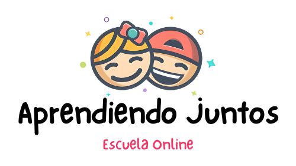
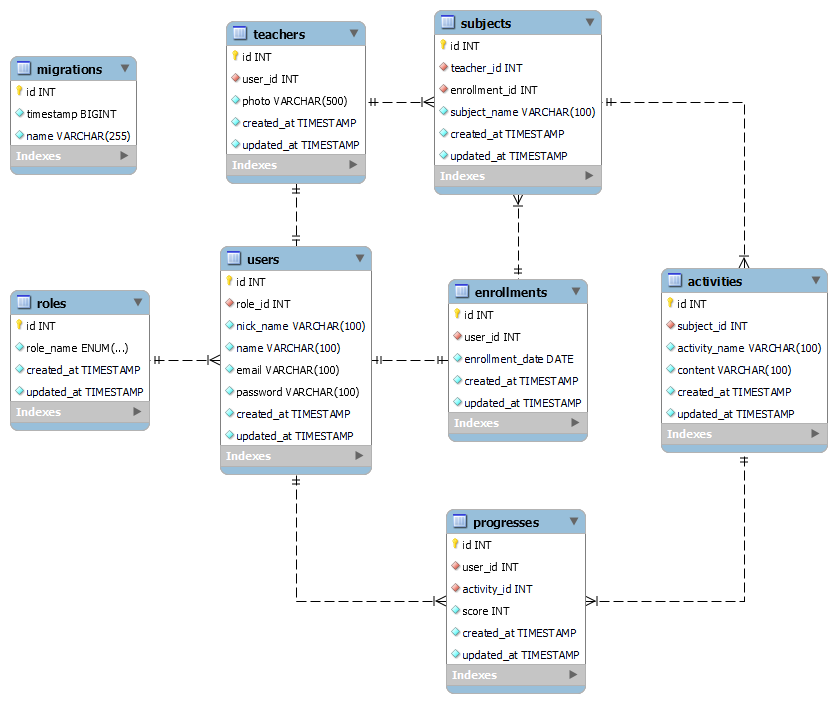

# <h1 align="center"> 🤓 Backend App - Aprendiendo Juntos ✏️</h1>

<div style="text-align: center;"></div>

<details>
  <summary> Contenido 📝</summary>
  <ol>
    <li><a href="#objetivo">Objetivo</a></li>
    <li><a href="#características-principales">Características Principales</a></li>
    <li><a href="#tecnologías-">Tecnologías</a></li>
    <li><a href="#diagrama-bd">Diagrama</a></li>
    <li><a href="#instalación-en-local">Instalación</a></li>
    <li><a href="#endpoints-">Endpoints</a></li>
    <li><a href="#contribuciones">Contribuciones</a></li>
    <li><a href="#licencia">Licencia</a></li>
    <li><a href="#webgrafia">Webgrafia</a></li>
    <li><a href="#agradecimientos">Agradecimientos</a></li>
    <li><a href="#contacto">Contacto</a></li>
  </ol>
</details>

## Objetivo
El objetivo principal del proyecto es desarrollar un backend robusto y eficiente para una plataforma de aprendizaje infantil. Esta plataforma tiene como finalidad proporcionar un entorno educativo interactivo para estudiantes, maestros y administradores, permitiendo la gestión de asignaturas, usuarios y actividades educativas.

## Características Principales
1. **Gestión de Usuarios:** Los usuarios podrán registrarse, iniciar sesión y gestionar su perfil. Habrá diferentes roles de usuario, como estudiantes, maestros y administradores, cada uno con sus respectivos permisos y funcionalidades.

2. **Gestión de Asignaturas:** Los estudiantes podrán matricularse en asignaturas. Cada asignatura contendrá información relevante como el nombre, descripción y recursos asociados.

3. **Gestión de Actividades:** Los estudiantes podrán ver las actividades disponibles. Estas actividades estarán disponibles para que los estudiantes las completen y puedan recibir retroalimentación.

4. **Administración del Sistema:** Los administradores tendrán acceso a herramientas de administración avanzadas para gestionar usuarios, asignaturas y actividades. Podrán asignar roles, monitorear el progreso del aprendizaje y generar informes.

## Tecnologías 🚀
<div align="center">


 </div>


## Diagrama BD
El diagrama de la plataforma de aprendizaje infantil representa la arquitectura y las interacciones entre los diferentes componentes del sistema. Está diseñado para proporcionar una visión general clara de cómo se estructura y funciona el backend de la aplicación. 

Muestra las relaciones que tendrán cada una de las tablas creadas, dando la posibilidad de asignar roles de student a los estudiantes, teacher para maestros y super_admin para los responsables de gestionar la aplicación, con diferencia de privilegios en la base de datos para cada uno. 
<div style="text-align: center;">
 
</div>

## Instalación en local
1. Clonar el repositorio
2. ` $ npm install `
3. Conectamos nuestro repositorio con la base de datos 
4. ``` $ Ejecutamos las migraciones ``` 
5. ``` $ npm run dev ``` 

Se podrá acceder a la aplicación a través de http://localhost:5173/ para el frontend y http://localhost:3000/ para el backend.

## Endpoints 📍
<details>
<summary>Endpoints</summary>

- USERS
    - REGISTER

            POST http://localhost:3000/user/register

        body:
        ``` js
            {
                "nick_name": "David1312",
                "name":"David",
                "email": "david@david.com",
                "password": "123456"
            }
        ```
        - REGISTER NEW TEACHER

            POST http://localhost:3000/user/createteacher

            body:
        ``` js
            {
                "nick_name": "David1312",
                "name":"David",
                "email": "david@david.com",
                "password": "123456"
                "photo":"http://",
                "subject": "matematica"
            }
        ```

    - LOGIN

            POST http://localhost:3000/user/login  

        body:
        ``` js
            {
                "email": "david@david.com",
                "password": "123456"
            }
        ```

    - PROFILE

          GET http://localhost:3000/user/:id

    - Insertamos el ID del user para que nos muestre todos los datos

    - UPDATE

          PATCH http://localhost:3000/user/:id

    body:

    ```js
        {
            "name": "NewUserNew",
            "password": "NewPrinces1234@",
            "phone_number": "55555559"
        }
    ```

    - GET ALL SUBJECTS

          GET http://localhost:3000/api/subjects/list

    - GET ALL USERS

          GET http://localhost:3000/users/allusers

    - REMOVE USER

          DELETE http://localhost:3000/users/:id

</details>
<details>
<summary>SUBJECTS ENDPOINTS</summary>

- SUBJECTS
    - CREATE 

              POST http://localhost:3000/api/subjects/newSubject

    body:

    ```js
        {
            "user_id": "1",
            "teacher_id": "1",
            "activity_id": "1",
            "subject_name": "Matematica",
        }

    ```

    - UPDATE

          PATCH http://localhost:3000/api/subjects/:id

    body:

    ```js
        {
            "user_id": "1",
            "teacher_id": "1",
            "activity_id": "1",
            "subject_name": "Ingles",
        }
    ```

    - DELETE

          DELETE http://localhost:3000/subjects/:id

    - GET ALL SUBJECTS BY STUDENT

          GET http://localhost:3000/subjects/user/:id

    - GET ALL SUBJECTS BY TEACHER

          GET http://localhost:3000/subjects/teacher/:id

</details>


## Contribuciones
Las sugerencias y aportaciones son siempre bienvenidas.  

Puedes hacerlo de dos maneras:

1. Abriendo una issue
2. Crea un fork del repositorio
    - Crea una nueva rama  
        ```
        $ git checkout -b feature/nombreUsuario-mejora
        ```
    - Haz un commit con tus cambios 
        ```
        $ git commit -m 'feat: mejora X cosa'
        ```
    - Haz push a la rama 
        ```
        $ git push origin feature/nombreUsuario-mejora
        ```
    - Abre una solicitud de Pull Request

## Licencia
Este proyecto está bajo la Licencia MIT. Consulte el archivo de LICENCIA para obtener más información.

## Webgrafia:
Para conseguir mi objetivo he recopilado información de:
- https://github.com/fidelfsd/fsd-online-express-typeorm-academy-api
- https://typeorm.io/
- https://orkhan.gitbook.io/typeorm/docs/migrations

## Agradecimientos:

Este proyecto ha sido posible gracias a todos los que hacen vida en **GeekHubs Academy**, quienes compartieron sus conocimientos con estusiasmo y mucha dedicación, durante esta etapa de aprendizaje que aun no termina, ademas a mis compañeros, por el apoyo incondicional y muy paciente.:

- **GeekHubs Academy** 
<a href="https://geekshubsacademy.com/" target="_blank"></a>

- **Gabriel Escudillo**  
<a href="https://github.com/GabrielEscudillo" target="_blank"></a> 

- **Erika Orlando**  
<a href="https://github.com/AkireOrl" target="_blank"></a>

## Autor

- **Pedro Rondón León**

## Contacto   
<a href = "mailto:pedro.rondonx@gmail.com"  target="_blank">

</a>
<a href="https://github.com/pedrowolfr"  target="_blank">
    
</a>  
<a href="https://www.linkedin.com/in/pedro-rond%C3%B3n-leon-1224ba168/" target="_blank">

</a> 

[](#) 
